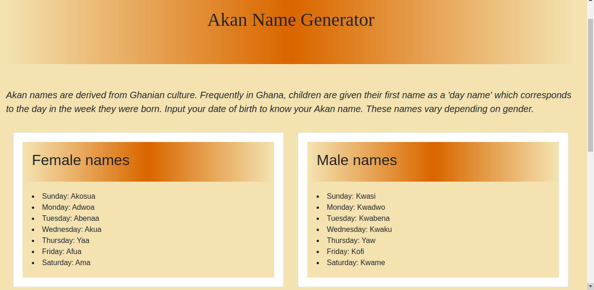
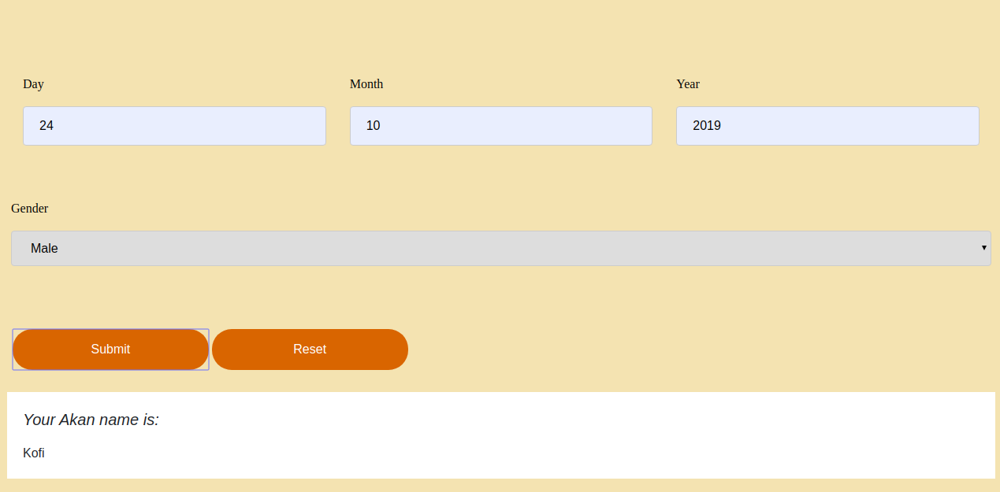

# Portfolio
#### This is my first Portfolio Landing Page, 18th October 2019
#### Authors
- [nessa-waithaka](https://github.com/nessa-waithaka)
## Description
This website generates the day of the week the user was born and gives an Akan name as per Ghanaian culture. An Akan name is given to children as their first name depending on the day of the week they were born. 
## Screenshots

## Setup/Installation Requirements
To start using this project use the following commands:
- `git clone https://github.com/nessa-waithaka/Akan-names.git`
- `cd Akan-names`
- `atom .`
- `code .` [//]: # (this is if Visual Studio Code is your preferred text editor)
## Technologies used
* HTML
* CSS
* Javascript
## Behavior Driven Development (BDD)
| Behavior | Input    | Output   |
| :------------- | :------------- | :------------- |
| User authentication | click on the sign up button  | registration form |
| Profile editing | Click on edit profile button  | profile page form|
| User can view details of a single post | Click on a specific post  | Profile page details form |
| User can search for specific stories | Input a keyword on the search bar | Results-page |
| User can view stories related to what their interests| Clicks on shared posts button| Feeds Page |

## Known Bugs 
The formula sometimes generates inconsistent results. This will be fixed before deployment.
## Support and contact details
Incase of any issues, questions, ideas or concerns.  Make acontribution to the code by contacting me through [vanessa.waithaka@gmail.com](vanessa.waithaka@gmail.com) .
### License
*MIT LICENSE*   
Copyright (c) 2019 **Vanessa Waithaka**